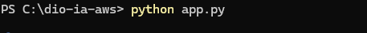

# 🤖 Análise Inteligente de Imagens, Textos e Sentimentos com IA na AWS

## 📌 Visão Geral do Projeto

Este repositório contém a implementação prática de uma solução de **Inteligência Artificial Aplicada** desenvolvida durante o bootcamp da **DIO (Digital Innovation One)**.

O objetivo do projeto é demonstrar como orquestrar múltiplos serviços cognitivos gerenciados da AWS usando Python para analisar dados visuais e textuais.

---

## 🏗️ Arquitetura e Serviços Utilizados

| Serviço AWS | Função no Projeto | Analogia Didática |
| :--- | :--- | :--- |
| **Amazon Rekognition** | Detecção de rótulos, objetos e cenas em imagens | 👀 *Os Olhos do Sistema* |
| **Amazon Textract** | OCR inteligente para extração de texto em mídias | 📖 *A Lupa de Leitura* |
| **Amazon Comprehend** | Processamento de Linguagem Natural (NLP) e Sentimentos | 💭 *O Sensor de Emoções* |

---

## 🚀 Como Executar o Projeto Localmente

### 1. Pré-requisitos
- Python 3.9+ instalado
- Conta ativa na AWS com credenciais configuradas

### 2. Instalação
Clone o repositório e instale as dependências:
\`\`\`bash
git clone https://github.com/SEU-USUARIO/SEU-REPOSITORIO.git
cd SEU-REPOSITORIO
pip install -r requirements.txt
\`\`\`

### 3. Configuração das Variáveis de Ambiente
Crie um arquivo `.env` na raiz do projeto (nunca faça commit deste arquivo):
\`\`\`env
AWS_ACCESS_KEY_ID=sua_access_key
AWS_SECRET_ACCESS_KEY=sua_secret_key
AWS_DEFAULT_REGION=us-east-1
\`\`\`

### 4. Execução
Adicione sua imagem de teste como `exemplo.jpg` e execute:
\`\`\`bash
python app.py
\`\`\`

---

## 📊 Evidências de Execução (Prints)

### 🖥️ Resultado da Execução do Script Python

---

## 💡 Principais Insights e Aprendizados

1. **Abstração de Modelos Complexos:** Os serviços pré-treinados da AWS permitem integrar Visão Computacional e NLP em aplicações com pouquíssimas linhas de código, dispensando o treinamento de redes neurais do zero.
2. **Importância do Score de Confiança (Confidence):** Tanto o Rekognition quanto o Textract fornecem métricas de probabilidade, o que permite criar regras de negócio seguras (ex.: só aceitar identificações com >80% de precisão).
3. **Boas Práticas de Segurança em Nuvem:** Uso de variáveis de ambiente (`.env`) e `.gitignore` para impedir o vazamento acidental de chaves de API públicas no GitHub.

---

## 🔮 Possibilidades de Evolução

- [ ] Criar uma interface web amigável com **Streamlit** ou **Gradio**.
- [ ] Implementar leitura de notas fiscais em lote com envio de alertas automáticos.
- [ ] Pipeline Serverless usando **AWS Lambda** e **Amazon S3** para análise em tempo real ao fazer upload de imagens.

---

## 👨‍💻 Autor

Desenvolvido por **[Elias Santos]**  
- LinkedIn: [https://www.linkedin.com/in/elias-santos-/]
- GitHub: [github.com/elias-santos87]